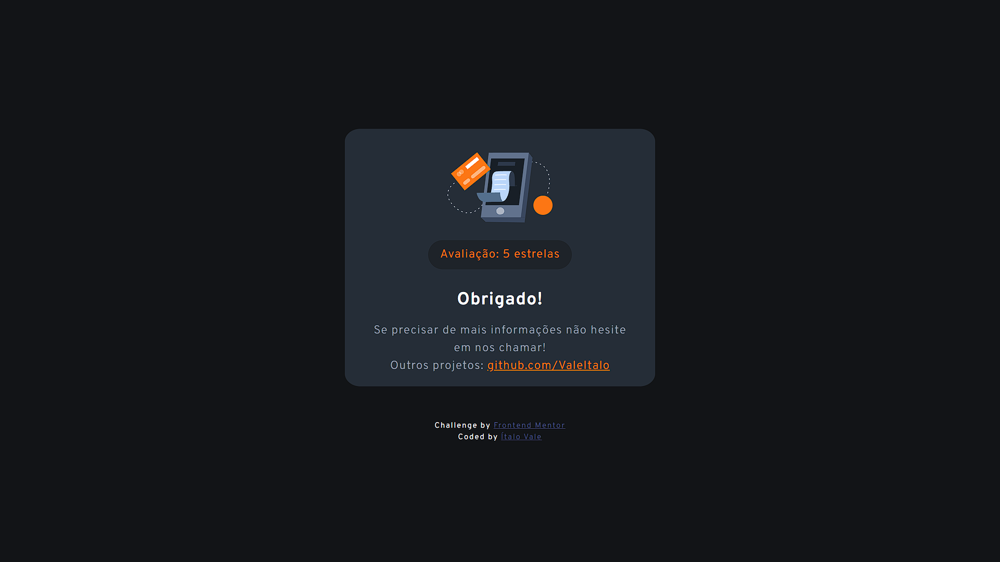

# Frontend Mentor - Componente interativo de avaliação

Essa é a minha solução para o desafio [Interactive rating component challenge on Frontend Mentor](https://www.frontendmentor.io/challenges/interactive-rating-component-koxpeBUmI)

## Índice

  - [O desafio](#O-desafio)
  - [Minha Solução - Screenshot](#Minha-Solução-Screenshot)
  - [Links](#links)
  - [Criação](#Criação)
  - [O que eu aprendi](#O-que-eu-aprendi)
  - [Autor](#Autor)


### O desafio

O usuário deve ser capaz de:

- Ver o layout responsivo compatível com o tamanho da tela
- Ver a mudança do layout baseado no pseudo elemento :hover
- Selecionar e enviar uma nota
- Ver a imagem "Obrigado!" após enviar o formulário de avaliação


### Minha Solução - Screenshot





### Links

- Live Site URL: [Avaliação Interativa](https://avaliacao-interativa.netlify.app/)


### Criação

- HTML semântico
- Variáveis CSS
- Flexbox
- Mobile-first
- JavaScript


### O que eu aprendi

A proposta de utilziar variáveis CSS para as cores foi extremamente útil. 

Eu pretendo utilizar esta técnica nos meus próximos projetos.

```
:root {
    --orange: hsl(25, 97%, 53%);
```


## Autor

- GitHub - [ValeItalo](https://github.com/ValeItalo)
- Frontend Mentor - [@ValeItalo](https://www.frontendmentor.io/profile/ValeItalo)